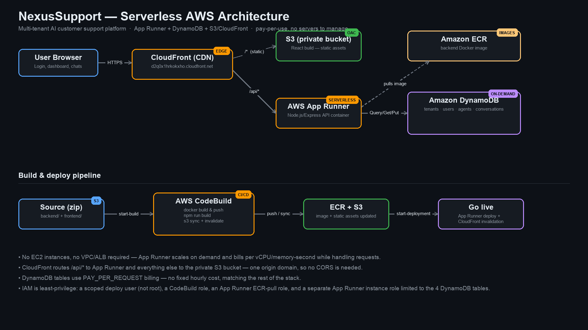

# NexusSupport — Project Document

**Multi-Tenant AI Customer Support Platform**
Live URL: https://d2q0x1hrkokxho.cloudfront.net

---

## 1. Executive Summary

NexusSupport is a multi-tenant customer support demo application covering chat, voice, and AI-agent workflows for three sample tenants (ShopNow, CloudStack, MedCare). It is deployed on AWS using a fully serverless architecture — no EC2 instances, no VPC/load balancer to manage — so cost scales with actual usage rather than fixed uptime.

| | |
|---|---|
| **Frontend** | React 18 + Vite, served as a static bundle |
| **Backend** | Node.js / Express REST API |
| **Database** | Amazon DynamoDB (on-demand billing) |
| **Compute** | AWS App Runner (serverless containers) |
| **Delivery** | Amazon CloudFront + private S3 |
| **CI/CD** | AWS CodeBuild (Docker build/push + frontend build/sync) |

---

## 2. Architecture



### Request flow
1. The browser hits **CloudFront** (`d2q0x1hrkokxho.cloudfront.net`), the single public entry point.
2. CloudFront routes by path:
   - Everything **except** `/api/*` → a **private S3 bucket** holding the built React app, fetched via **Origin Access Control (OAC)** — the bucket has no public access, only CloudFront can read it.
   - `/api/*` → **AWS App Runner**, which runs the Express API in a container.
3. App Runner reads/writes **DynamoDB** for all tenant, user, agent, and conversation data.
4. Because both the frontend and API are served from the same CloudFront domain, there is no cross-origin request — no CORS configuration is needed.

### Why App Runner instead of ECS+ALB
App Runner runs the same Docker image with no VPC, no Application Load Balancer, and no fixed hourly charge for idle infrastructure — it scales with request volume, matching the "pay only for what's used" goal for this project. (An ECS Fargate + ALB design was prototyped first but discarded in favor of App Runner once eligibility was confirmed on this AWS account.)

### Build & deploy pipeline
1. Backend and frontend source is zipped and uploaded to an **artifact S3 bucket**.
2. **AWS CodeBuild** runs a single build that:
   - Builds the backend Docker image and pushes it to **Amazon ECR**
   - Runs `npm run build` for the frontend and syncs the output to the frontend S3 bucket
   - Invalidates the CloudFront cache
3. A separate `apprunner:StartDeployment` call rolls the new image out to App Runner (auto-deploy-on-push is intentionally disabled so deploys are explicit).

---

## 3. Database Schema (DynamoDB)

All tables use **PAY_PER_REQUEST** billing (no fixed cost, no capacity planning).

| Table | Partition Key | GSI | Purpose |
|---|---|---|---|
| `nexussupport-tenants` | `id` | — | Tenant profile + per-tenant settings |
| `nexussupport-users` | `id` | `email-index` (PK: `email`) | Login lookup by email |
| `nexussupport-agents` | `id` | `tenantId-index` (PK: `tenantId`) | AI agent roster per tenant |
| `nexussupport-conversations` | `id` | `tenantId-index` (PK: `tenantId`, SK: `updatedAt`) | Support conversations per tenant |

Conversation **messages** are generated deterministically from each conversation record at read time rather than stored as separate rows — there is currently no API endpoint that creates new messages, so this mirrors the original demo behavior exactly while everything that *is* written (tenant settings, seeded records) persists for real.

---

## 4. Security & IAM

- A dedicated **`nexussupport-deployer`** IAM user (not the AWS account root) is used for all deployments, scoped to only the services this project needs.
- **CodeBuild role** — permissions limited to this project's ECR repo, its two S3 buckets, and CloudFront invalidation.
- **App Runner ECR-access role** — only allowed to pull from ECR (`AWSAppRunnerServicePolicyForECRAccess`).
- **App Runner instance role** — separate from the ECR-access role, scoped to `GetItem/PutItem/UpdateItem/DeleteItem/Query/Scan` on only the 4 DynamoDB tables (plus their indexes) this app owns.
- The frontend **S3 bucket is fully private**; CloudFront reaches it only via Origin Access Control, satisfying the account's S3 Block Public Access setting rather than working around it.
- Secrets (JWT signing secret, Anthropic API key) are passed as CloudFormation `NoEcho` parameters and injected as App Runner runtime environment variables — never committed to source control.

---

## 5. Cost Model

Every layer in this stack is consumption-based:

| Component | Pricing model |
|---|---|
| App Runner | Per vCPU-second / GB-second while handling requests |
| DynamoDB | Per request (PAY_PER_REQUEST) + storage |
| S3 + CloudFront | Per GB stored / transferred + per request |
| ECR | Per GB of image storage |
| CodeBuild | Per build-minute (only runs on deploy) |

There is no idle fixed-cost component (no ALB, no NAT gateway, no provisioned database capacity).

---

## 6. Known Limitations

- **AI is not wired up yet.** Tenant records reference AI model names (`claude-sonnet-4-6`, etc.) and an `AnthropicKey` parameter exists in the stack, but the backend does not currently call the Anthropic API — conversation content is demo/seed data.
- **Conversation messages are generated, not stored** — see §3.
- **Voice pipeline (Twilio/Deepgram/ElevenLabs) referenced in the README is not implemented** in this deployment; it is UI/demo only.

---

## 7. Demo Access

| Role | Email | Password |
|---|---|---|
| ShopNow Admin | admin@shopnow.com | demo1234 |
| ShopNow Agent | agent@shopnow.com | demo1234 |
| CloudStack Admin | admin@cloudstack.com | demo1234 |
| CloudStack Agent | agent@cloudstack.com | demo1234 |
| MedCare Admin | admin@medcare.com | demo1234 |
| Super Admin | superadmin@nexussupport.com | admin1234 |

---

## 8. Repository Layout

```
nexussupport/
├── backend/
│   ├── server.js        # Express API routes
│   ├── db.js             # DynamoDB data-access layer
│   ├── seed.js            # Seeds demo data into DynamoDB
│   └── Dockerfile
├── frontend/
│   ├── src/
│   └── vite.config.js
├── infra/
│   └── cloudformation.yml # Full AWS stack: App Runner, DynamoDB, S3, CloudFront, CodeBuild, IAM
└── docs/
    ├── PROJECT_DOCUMENT.md
    ├── architecture.png
    └── NexusSupport_Presentation.pptx
```
